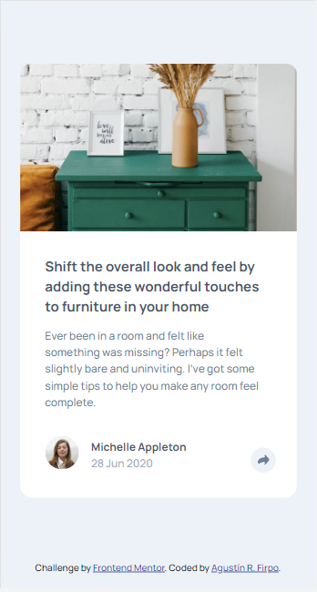
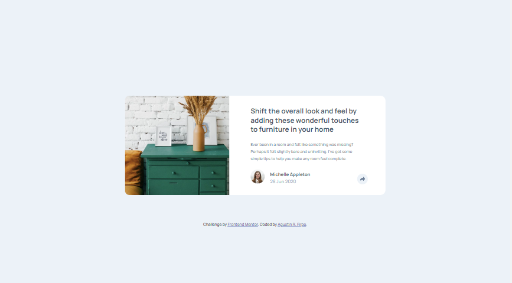

# Frontend Mentor - Article preview component solution

This is a solution to the [Article preview component challenge on Frontend Mentor](https://www.frontendmentor.io/challenges/article-preview-component-dYBN_pYFT). Frontend Mentor challenges help you improve your coding skills by building realistic projects.

## Table of contents

- [Overview](#overview)
  - [The challenge](#the-challenge)
  - [Screenshot](#screenshot)
  - [Links](#links)
- [My process](#my-process)
  - [Built with](#built-with)
  - [What I learned](#what-i-learned)
  - [Continued development](#continued-development)
  - [Useful resources](#useful-resources)
- [Author](#author)
- [Acknowledgments](#acknowledgments)

## Overview

### The challenge

Users should be able to:

- View the optimal layout for the component depending on their device's screen size
- See the social media share links when they click the share icon

### Screenshot

### Links

- Solution URL: [Add solution URL here](https://your-solution-url.com)
- Live Site URL: [Add live site URL here](https://your-live-site-url.com)

## My process

### Built with

- Semantic HTML5 markup
- CSS custom properties
- CSS media queries.
- Flexbox
- CSS animations (transform & transition)
- Mobile-first workflow

### What I learned

- El uso del metodo "toogle" in javascript;
- El uso del parametro background-position, la posibilidad de usar valores negativos para posicionar elementos por fuera de la caja contenedora y deshabilitarlo con el valor "unset".
Además, reforcé mis conocimientos sobre:
- Display flex;
- Posición absoluta/relativa;
- El uso de z-index;
- Uso de animaciones para dar más vida a los elementos interactivos de mis paginas.
- Manipulación de imagenes en formato SVG, principalmente el atributo "fill"

### Continued development

In future challenges I would like to deepen and master the use of display flex/grid and consolidate my javascritp management in relation to cssy html

**Note: Delete this note and the content within this section and replace with your own plans for continued development.**

### Useful resources

- [Coding-Tube] (https://www.youtube.com/watch?v=ej6fYg1f5eA&t=8519s) - This helped me as guide to resolve the challenge. I really liked this tutorial and gave me tools that i will use it going forward.

## Author

- LinkedIn - [Agustín R. Firpo](https://www.linkedin.com/in/agustin-rodrigo-firpo-0aa86697/)
- Frontend Mentor - [@Arfirpo](https://www.frontendmentor.io/profile/Arfirpoe)

